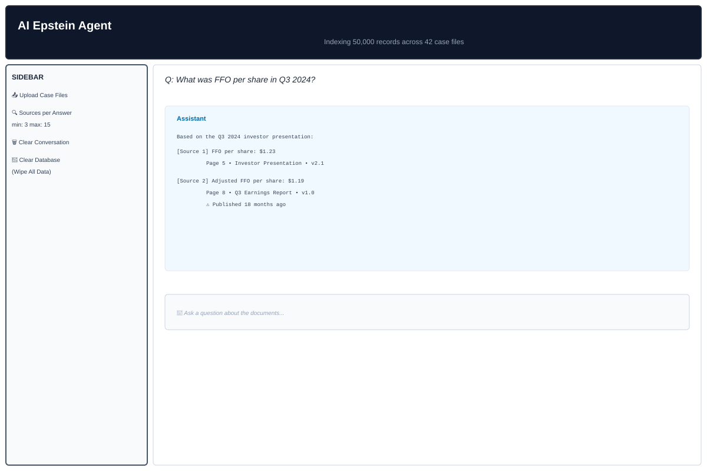

# InsightLens


> **Ask questions across multiple investment documents and get answers with citations pinned to the exact source, page, and document version — in seconds.**

---

## What It Does

Drop investor decks, earnings presentations, and strategy reports into a folder. InsightLens reads them, understands them, and lets you ask questions in plain English. Every answer comes with source cards showing exactly which document, page, and version the information came from.

```
"How did Digital Realty's strategy shift between December 2025 and March 2026?"
→ [Source 1] Dec deck p.4  ·  [Source 2] Mar deck p.7  — both versions cited side by side
```

---

## Retrieval Pipeline

Every question runs through 8 sequential stages:

| Stage | What it does |
|---|---|
| **Vector Search** | Converts the question into 384 numbers and finds chunks with the closest meaning in Snowflake |
| **BM25 Keyword Search** | Matches exact terms like FFO, EBITDA, ticker symbols that semantic search can miss. Case-insensitive company filter |
| **RRF Fusion** | Combines both ranked lists — chunks near the top of both score highest |
| **Version Scoring** | Current documents get a 15% boost; superseded documents get a 20% penalty |
| **Chunk-Type Scoring** | Financial tables boosted 25% for numeric queries; body text boosted 10% for narrative queries |
| **Per-Document Quota** | On cross-company queries, no single document fills more than 3 slots — prevents one company dominating the answer |
| **Cross-Encoder Reranking** | Reads each (query, chunk) pair jointly and asks "does this actually answer the question?" — slower but more precise |
| **Deduplication** | Keeps only the top-ranked chunk per page so the same page never takes two citation slots |

After retrieval, a **company coverage guarantee** runs a secondary targeted search for any company named in the query that has zero chunks in the primary results.

---

## Ingestion Pipeline

| Feature | Detail |
|---|---|
| **Slide-Aware Chunking** | One slide = one chunk. Title-only pages are merged into the next content slide |
| **Table Extraction** | `pdfplumber` extracts row/column structure from every table as a separate `financial_table` chunk |
| **Vision Extraction** | Pages with fewer than 300 characters are rendered as PNG and sent to Claude vision — reads bar charts, geographic maps, and tenant logo tables that text extraction cannot access |
| **Footnote Tagging** | Bottom 25% of each slide is scanned for footnote patterns. Tagged lines are treated by Claude as authoritative overrides that can correct the headline figure above them |
| **Document Type Detection** | Priority-ordered pattern matching assigns specific labels: Q4 Update, Investor Day, Merger Presentation, Roadshow, Company Update, Third-Party Report |
| **Staleness Detection** | Sources older than 2 years get a warning flag in every citation |

---

## Generation

Claude receives up to 8 ranked source chunks and follows 12 explicit rules:

- Never fill gaps with training-data knowledge — say "not in sources" instead
- Show conflicting figures from different document versions separately with attribution
- Preserve scope qualifiers (e.g. "including development pipeline" vs "under ownership only") — never strip them to make numbers look comparable
- Treat `[FOOTNOTE]` tagged lines as authoritative overrides of headline figures
- Flag stale sources before presenting any figures from them
- Acknowledge when data is encoded in a visual element that text extraction cannot read
- On cross-company questions, address each company separately and name any that are absent from the corpus
- Apply document-type authority order: Q4 Update supersedes Investor Day on the same metric

---

## Tech Stack

| Layer | Tool |
|---|---|
| PDF parsing | PyMuPDF + pdfplumber |
| Vision extraction | Claude Sonnet (vision API) |
| Embeddings | `all-MiniLM-L6-v2` — local, free |
| Keyword search | `rank_bm25` |
| Reranker | `cross-encoder/ms-marco-MiniLM-L-6-v2` |
| Vector storage | Snowflake `VECTOR(FLOAT, 384)` |
| Generation | Claude Sonnet |
| UI | Streamlit |

---

## Quickstart

### Prerequisites
- Python 3.10+
- [Snowflake account](https://signup.snowflake.com) (free 30-day trial)
- [Anthropic API key](https://console.anthropic.com)

### Setup

```bash
git clone https://github.com/samarthnirula/rag-investment.git
cd rag-investment

python3 -m venv venv && source venv/bin/activate
pip install -r requirements.txt && pip install -e .

cp .env.example .env
# Fill in your Anthropic key and Snowflake credentials
```

### Run

```bash
# 1 — Create Snowflake tables (one-time)
python scripts/setup_database.py

# 2 — Ingest PDFs from data/raw_pdfs/
python scripts/ingest_documents.py

# 3 — Launch the app
./run.sh
# → http://localhost:8501
```

### Tests

```bash
pytest
```

---

## User Interface

The Streamlit app provides an intuitive chat-based interface for querying documents:



### Layout
```
┌─────────────────────────────────────────────────────────────────┐
│  AI Epstein Agent                                               │
│  Indexing 50,000 records across 42 case files                   │
├─────────────────────────────────────────────────────────────────┤
│                                                                 │
│  [SIDEBAR]                   │  [MAIN CHAT AREA]               │
│  ✓ Upload Case Files         │                                 │
│  ✓ Sources per Answer        │  Assistant: Here's what I found │
│    (slider: 3-15)            │  [Source 1] Court Doc p.3       │
│  ✓ Clear Conversation        │  [Source 2] Deposition p.7      │
│  ✓ Clear Database            │  [Source 3] Exhibit A p.2       │
│                              │                                 │
│                              │  [User message input box]       │
└─────────────────────────────────────────────────────────────────┘
```

### Features

| Feature | Description |
|---------|-------------|
| **File Upload** | Drag-and-drop PDFs, images (JPG, PNG, TIFF) directly into the app. Auto-triggers ingestion pipeline |
| **Chat History** | Conversation persists in session state. Previous questions and answers scroll with context |
| **Source Citations** | Each answer shows indexed source cards with: document name, page number, chunk type (table/body/chart), document version, staleness flags |
| **Financial Table Preview** | Tables from documents are rendered as formatted DataFrames inline — no need to jump to the PDF |
| **Source Filter** | Slider control to adjust how many sources appear in each answer (3–15 chunks) |
| **Clear Controls** | One-click buttons to clear conversation history or wipe the entire Snowflake database for fresh starts |
| **Metadata Bar** | Shows live stats: number of indexed documents, total chunks in vector store, file count in data folder |

### Answer Format

Answers appear in three tiers:

1. **Badge & Type** — Visual indicator (table icon, quote for narrative, $ for financial) + chunk type classification
2. **Content Preview** — First few lines of the source with HTML-styled formatting; longer passages scroll
3. **Metadata Footer** — Document name, page, version label (e.g. "v1.2"), staleness warning if >2 years old

### Interaction Flow

```
1. User types question
   ↓
2. Hybrid retrieval runs (vector + BM25 + RRF fusion)
   ↓
3. Top K chunks displayed with score badges
   ↓
4. Claude generates answer with inline [Source N] citations
   ↓
5. Clicking a source card opens the full chunk in a collapsible details panel
```

---

## Example Queries

The system is optimized for these types of questions:

### Financial Metrics
- "What was the NOI growth year-over-year?"
- "What is the Q3 2024 FFO per share?"
- "Compare dividend yield across properties"

### Cross-Document Analysis
- "How did the company's strategy shift between the Dec 2025 and Mar 2026 presentations?"
- "What acquisitions were announced vs. actually completed?"

### Entity & Relationship Queries
- "Which portfolio companies have the longest lease terms?"
- "Who are the major institutional investors mentioned?"

### Temporal Queries
- "What was the occupancy rate in each quarter of 2025?"
- "Track the debt-to-EBITDA ratio over time"

### Hybrid Keyword + Semantic
- "What does the court document say about liability?" (semantic matching on "responsibility/fault/accountability")
- "Find all mentions of 'experienced operator' or equivalent terms"

---

## Architecture


### Data Flow

1. **Ingestion**: PDFs/images → text extraction + vision API → slide-aware chunking → embedding
2. **Storage**: 384-dim vectors + metadata stored in Snowflake with document versioning
3. **Retrieval**: Hybrid pipeline (vector + BM25 + RRF + scoring + reranking)
4. **Generation**: Claude reads ranked chunks, generates answer with inline citations
5. **UI**: Streamlit chat with source cards, staleness flags, expandable details

### Retrieval Pipeline


---

## Evaluation Results

```
Hit@1  : 8/8  (100%)
Hit@3  : 8/8  (100%)
Hit@5  : 8/8  (100%)
MRR    : 1.000
```

Measured using `scripts/eval_retrieval.py` against 8 ground-truth queries across VICI and BXP. The eval run caught a real case-sensitivity bug in the company filter — fixing it took Hit@1 from 12% to 100%.
